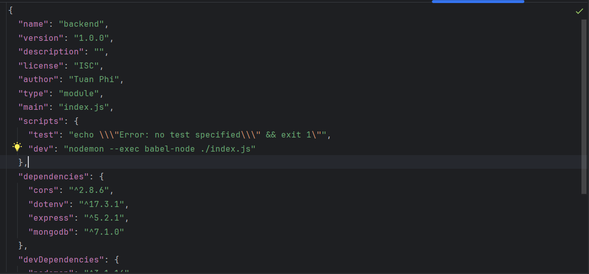
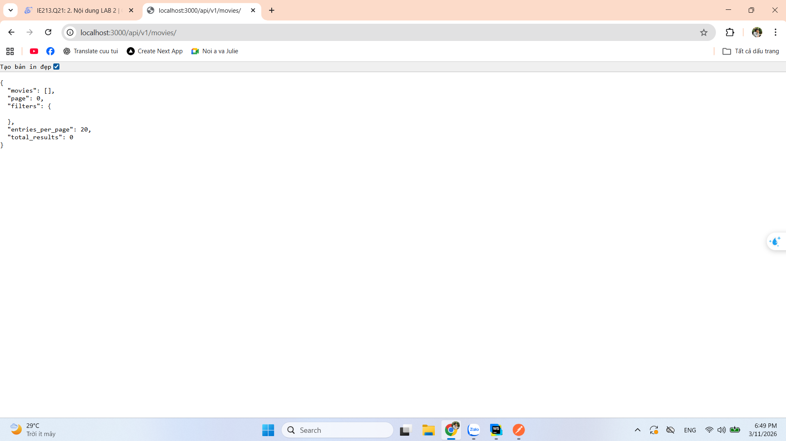
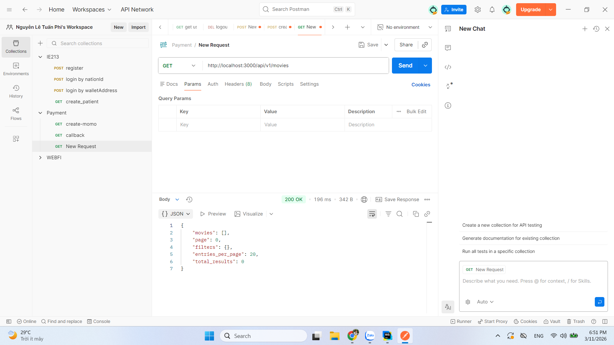

## Mục tiêu bài thực hành
- Thiết lập môi trường nodejs
- Tạo dự án backend
- Kết nối tới mongodb
- Viết được 1 api lấy movies

## Công cụ/ môi trường sử dụng
- ChatGPT: giúp sửa lại các syntax của express cũ
- webstorm: giúp viết code

## Lời giải 
- npm init (để khởi tạo môi trường nodejs)
- npm i cors express mongodb (để cài các thư viện)
- npm i -D nodemon (để  cài các các thư viện ở môi trường dev)
- npm run dev (để chạy server)
- sửa lại type: 'module' trong file package.json
- thêm trong script "dev": "nodemon --exec babel-node ./index.js" trong file package.json

- tạo file .gitignore để không push folder node_modules lên git

- Kết quả api http://localhost:3000/api/v1/movies

