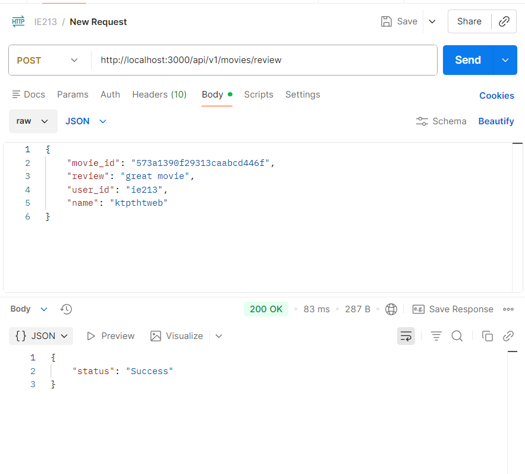
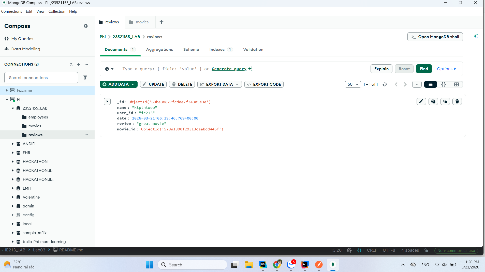
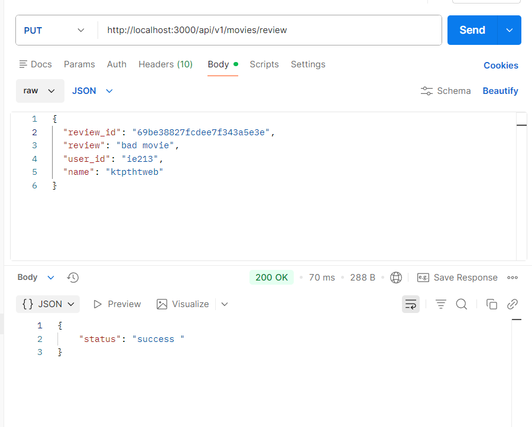
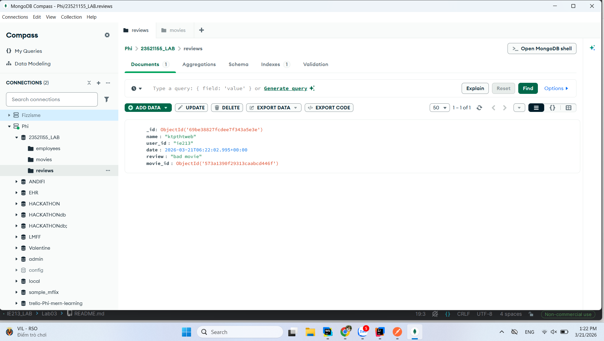
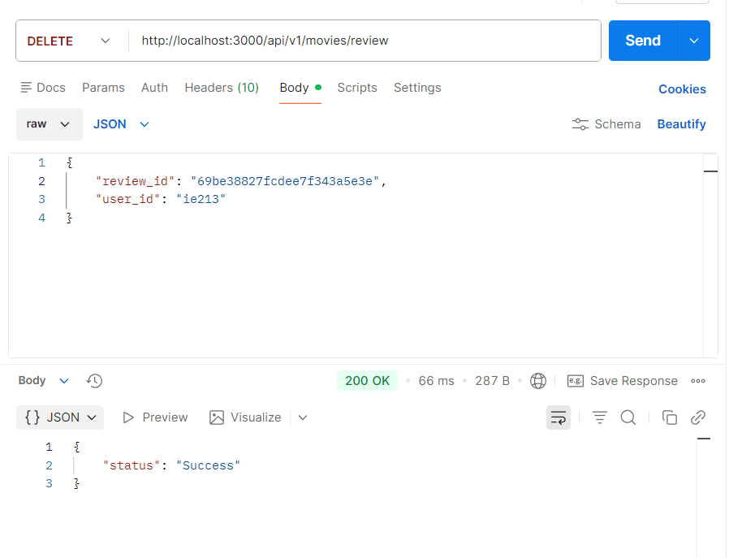
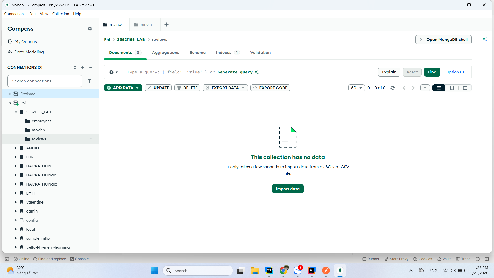
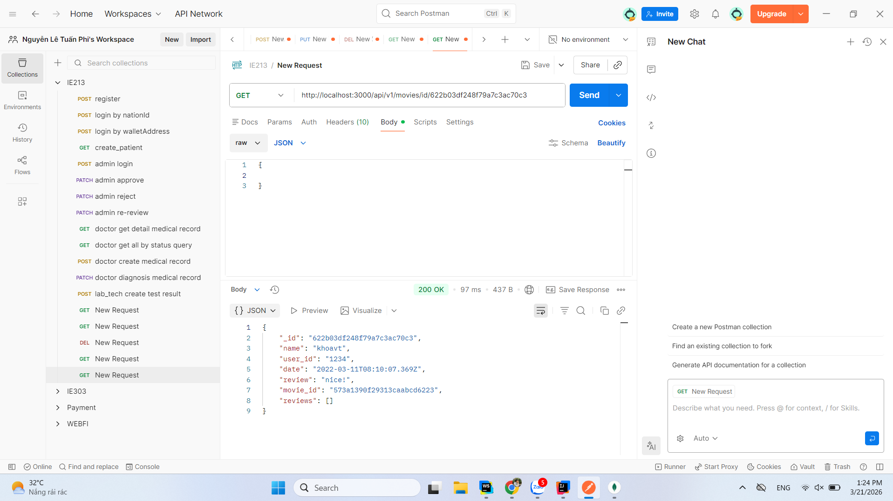
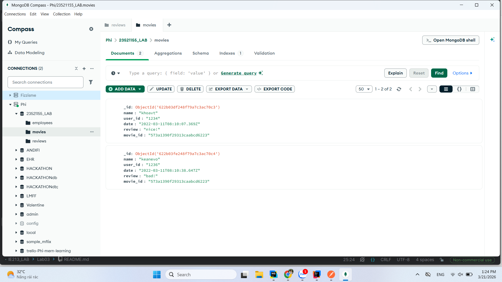
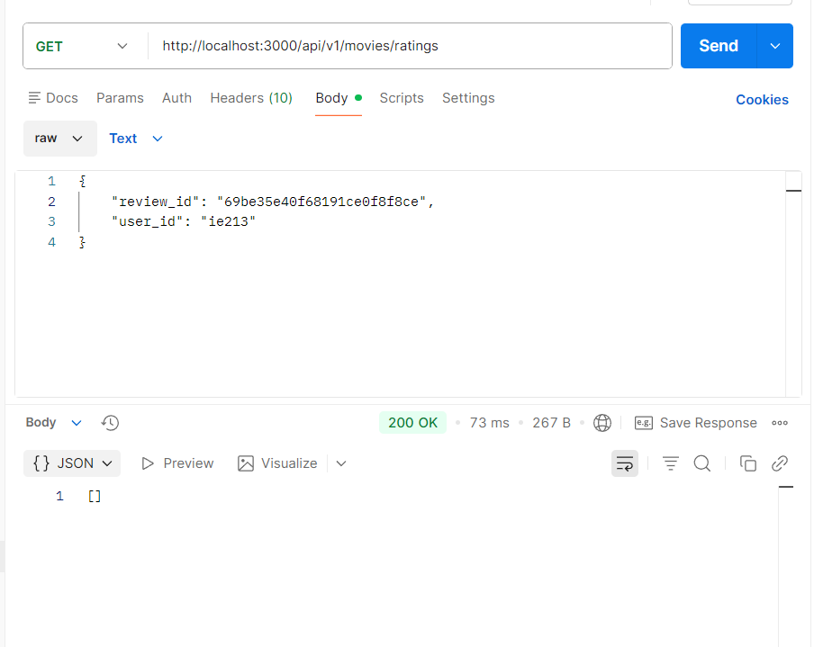

## Mục tiêu bài thực hành
- Viết api tạo review (post)
- Viết api sửa review (put)
- viết api xóa review (delete)
- viết api lấy movie theo id (get)
- viết api lấy ratings (get)

## Công cụ/ môi trường sử dụng
- webstorm: giúp viết code

## Lời giải 

- Kết quả api tạo review

- Kết quả api sửa review

- Kết quả api xóa review

- Kết quả lấy movie theo id

- Kết quả ly ratings

