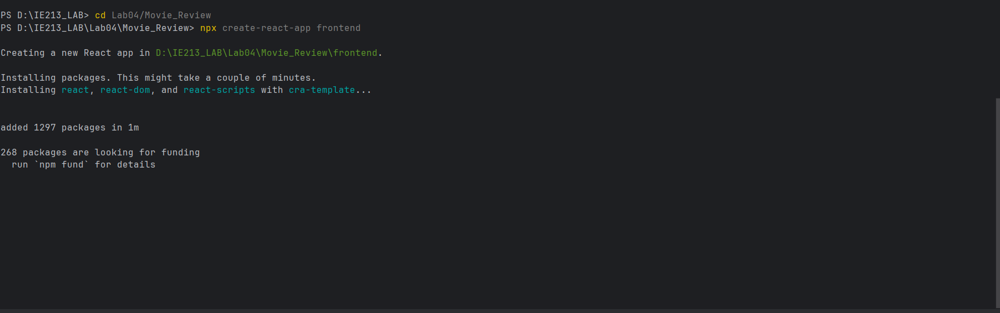
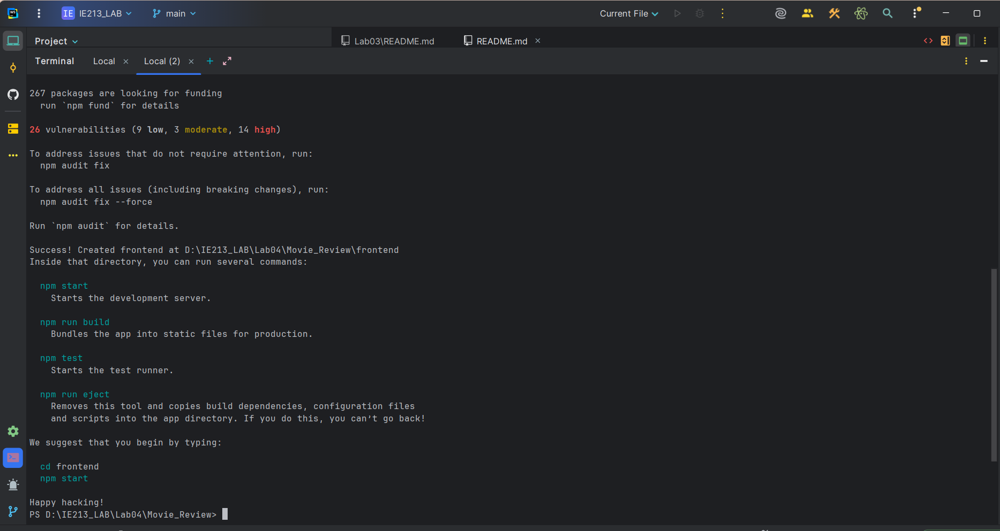
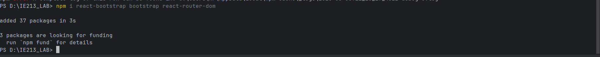
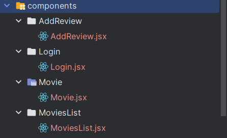
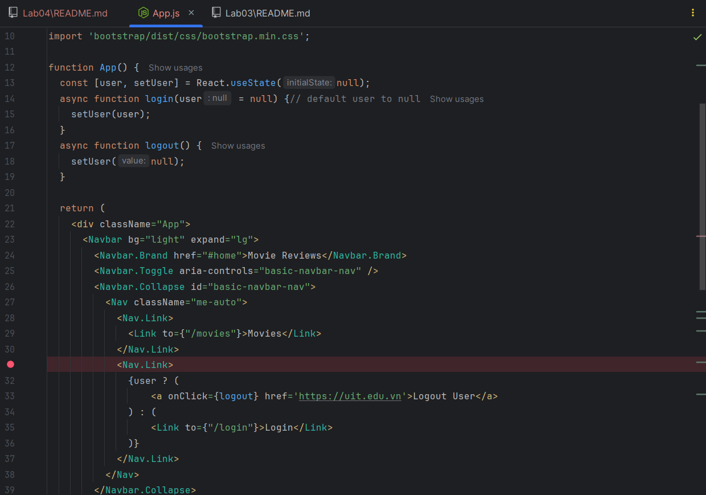
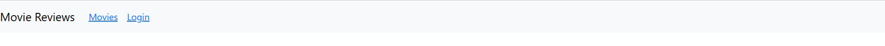
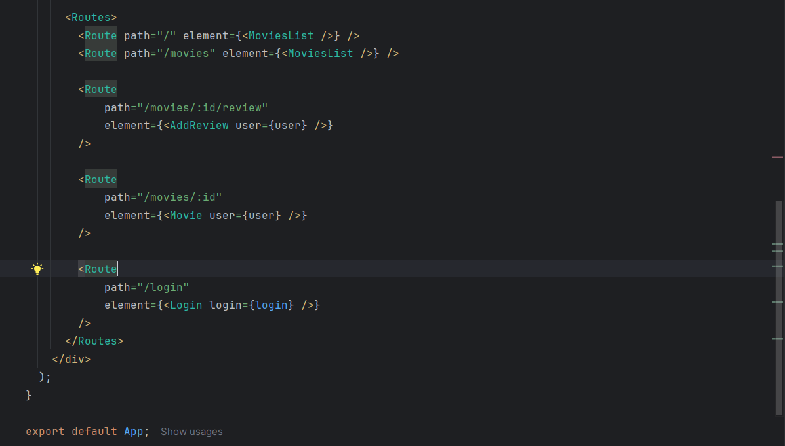

## Mục tiêu bài thực hành
- Thiết lập dự án react
- Tải các package hỗ trợ
- Tạo các components
- Sử dụng components navbar của react-bootstrap
- Viết routes để định tuyến

## Công cụ/ môi trường sử dụng
- webstorm: giúp viết code

## Lời giải 
- 1.1 Thiết lập react:
Bằng lệnh npx create-react-app frontend

- 1.2 Tải các package
Bằng lệnh npm i react-bootstrap bootstrap react-router-dom

- 2.1 Tạo các component trong thư mục components

- 2.2 Sử dụng component Nav của thư viện react-boostrap trong App.js

- 2.3 Sửa các thông tin

- 3.1, 3.2 Thiết lập định tuyến

