## Mục tiêu bài thực hành
- 1 Thêm và sửa review
- 2 Xóa review
- 3 Lấy dữ liệu cho trang tiếp theo

## Công cụ/ môi trường sử dụng
- webstorm: giúp viết code

## Lời giải
### 1.1 Tạo login component
- Vì react phiên bản mới nên em dùng useNavigate() để Link tới các trang trong dự án
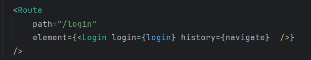

### Kết quả
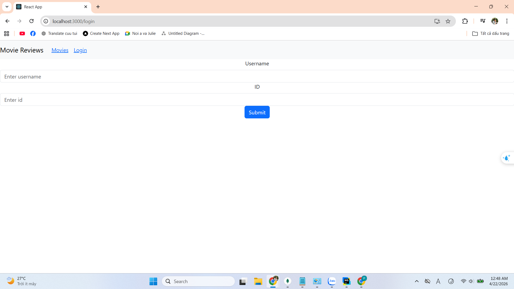
### 1.2 Thêm review
- Dùng useParams để lấy id của movie 
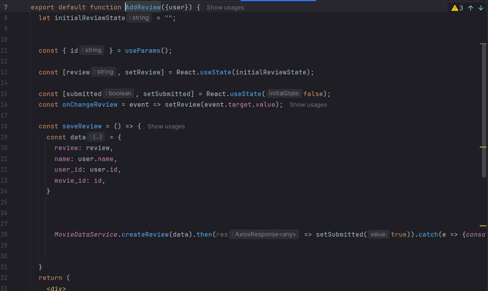

### Kết quả

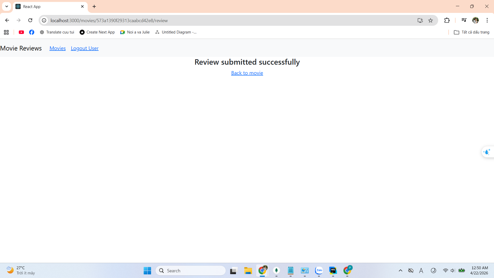
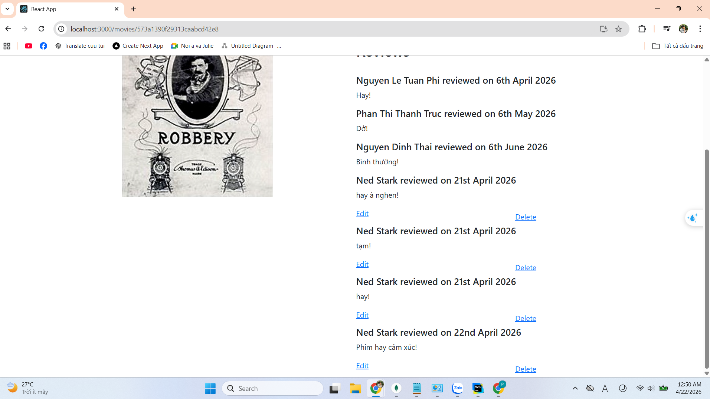
### 1.3 Sửa review
- Tách 1 component riêng để xử lý logic sửa review
- yêu cầu cần truyền thêm reviewId
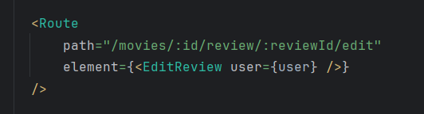
### Kết quả
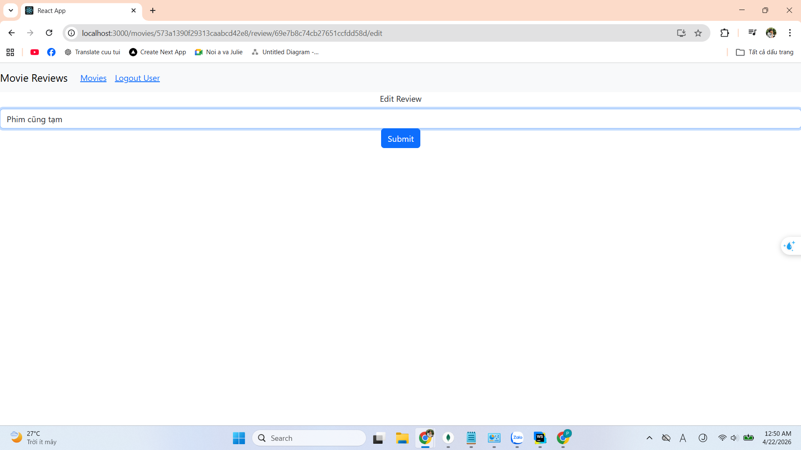
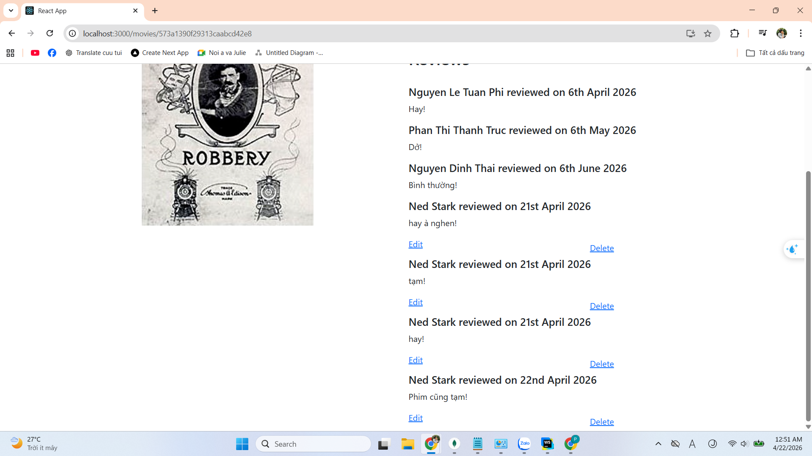

### 2 Xóa review
- Thêm event onClick vào để xóa review
- Cần truyền reviewId va userId
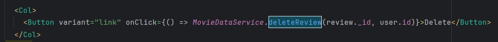

### 3.1 getAll()
- Thêm 2 nút chuyển trang
- Nếu trang hiện tại > 0 thì hiện cả 2 nút
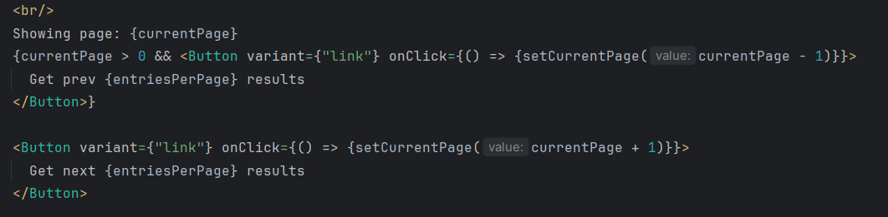
- Viết logic để chuyển trang component sẽ re-render fetch lại api danh sách phim với 2 query currentPage và entriesPerPage
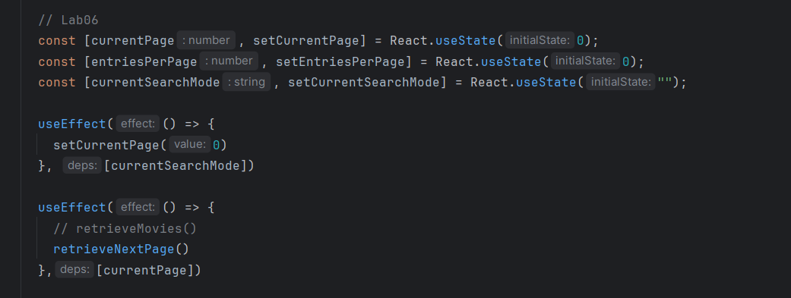
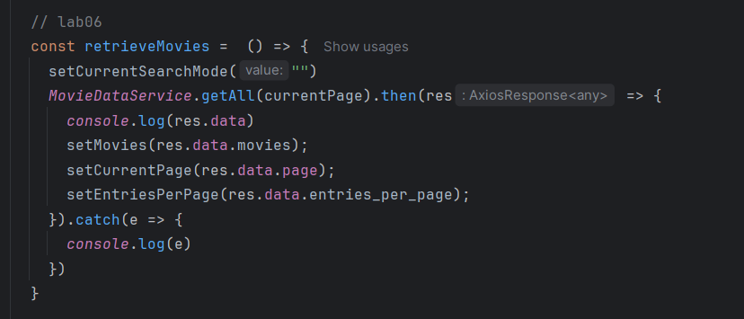

### Kết quả
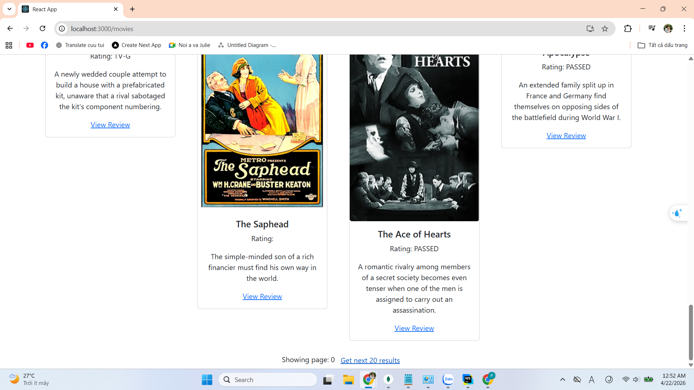
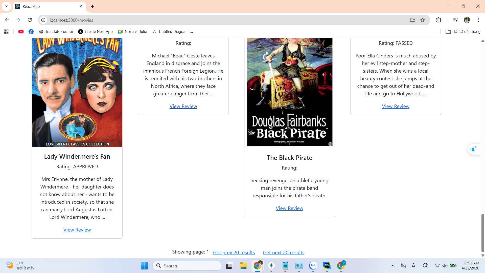
### 3.2 find()
- Viết hàm để chọn chế độ tìm theo title hay rating
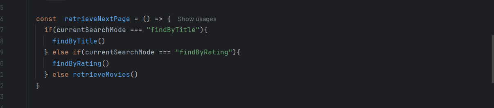
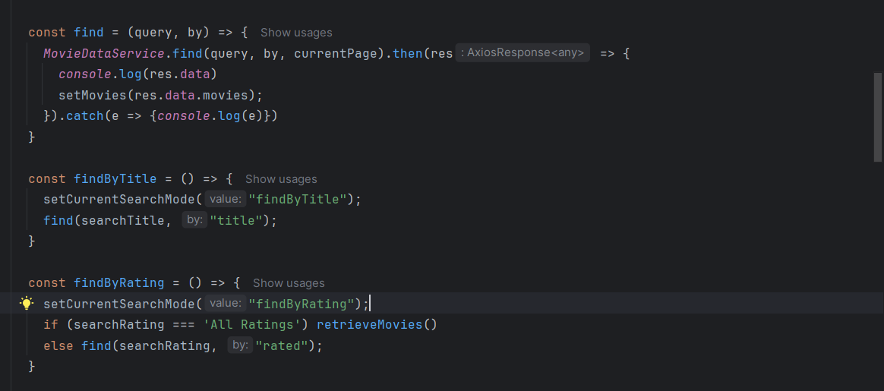
